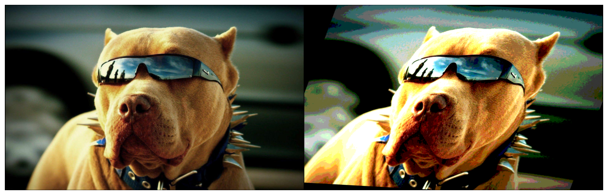

# FreeAugment - Data Augmentation Search Across All Degrees of Freedom


## Introduction :open_book:
This repository contains the official implementation of **FreeAugment**, as presented in our [ECCV 2024 paper](https://tombekor.github.io/FreeAugment-web).

Data augmentation is a cornerstone of deep learning, enhancing generalization by diversifying training data. However, designing optimal augmentation policies is challenging, as the best transformations depend heavily on the specific task and domain. **FreeAugment** addresses this challenge with a novel, fully differentiable framework that simultaneously optimizes all _four degrees of freedom_ in data augmentation:
1.   **Policy Depth** – Number of transformations applied sequentially.
2. **Types** – The specific transformations to use.
3. **Order** – The sequence in which transformations are applied.
4. **Magnitudes** – The intensity of each transformation.

For further details, refer to our [paper](https://arxiv.org/pdf/2409.04820).

## Requirements :snake:

Create a conda environment using `env.yml`

## Example :weight_lifting:
This example demonstrates how to use **FreeAugment** to apply data augmentations to a single image.
### Step 1: Set Up the Environment
First, import the necessary libraries and set up the device.
```python
import torch
from torchvision import transforms
from PIL import Image

from FreeAugment import FreeAugment

from dAugmentations.dRotation import DRotation
from dAugmentations.dBrightness import DBrightness
from dAugmentations.dColor import DColor

# Setup device
device = torch.device("cuda" if torch.cuda.is_available() else "cpu")
```

### Step 2: Load FreeAugment's configs
```python
with open('configs/FreeAugmentConf.yaml', 'r') as yaml_file:
	config = yaml.safe_load(yaml_file)
wandb_run = wandb.init(config=config)
```

### Step 3: Define Augmentations

Specify the data augmentation operations you want to apply.
```python
# Define augmentations
augmentations = [
	[
	    DRotation(low_m=-30., high_m=30., device=device),  # Rotate between -30. to 30. degrees
	    DContrast(low_m=0.4, high_m=2.0, device=device),  # Adjust the contrast
	    DPosterize(low_m=2.0, high_m=8.0, device=device),  # Reduce the number of bits for each color channel
	]
	for  _  in  range(wandb.config["k"])
]

# Initialize FreeAugment with the augmentations
aa_module = FreeAugment([augmentations], device=device).to(device)
```


### Step 3: Load and Preprocess the Image

Load the image, resize it, and convert it into a tensor.
```python
# Load and preprocess image
image_path = "example_image.jpg"  # Replace with your image path
image = Image.open(image_path).convert("RGB")

transform = transforms.Compose([
    transforms.Resize(image_size),  # Resize to image_size
    transforms.ToTensor()           # Convert to tensor
])
image_tensor = transform(image).unsqueeze(0).to(device)  # Add batch dimension

```

### Step 4: Apply Augmentations

Use the `FreeAugment` module to augment the image.
```python
# Apply augmentations
augmented_image = aa_module(tensor_image)
```
### Step 5: Visualize the Results

Display the original and augmented images side by side.
```python
# Visualize the original and augmented images
from utils import plot_tensors  # Utility to plot tensors
plot_tensors([tensor_image, augmented_image])
```


### Step 6: Compute Gradients
Lastly, let's demonstrate the differentiability of FreeAugment's pipeline by calculating a dummy loss and backpropagating through the augmentations.

```python
# Compute a dummy loss
loss = augmented_image.sum()

# Perform backpropagation
loss.backward()

# Check gradients for FreeAugment's learnable depth
print("FreeAugment's betas.grad:", aa_module.betas.grad)
```


## Code Structure and Key Modules :jigsaw:

This section provides an overview of the main modules and components implemented in the codebase.

### :one: FreeAugment

| **Property**                 | **Description**                                                                                                                                          |
|-------------------------------|----------------------------------------------------------------------------------------------------------------------------------------------------------|
| `k`                           | Maximal depth of the model (K from the paper) - Number of augmentation layers `AugLayer` in `k_AugLayers`.                                                                                              |
| `k_AugLayers`                 | `nn.ModuleList` composed of `k` augmentation layer instances (`AugLayer`) .                                                             |
| `betas`                       | Learnable parameters representing the logits for the depth selection probabilities, initialized as a uniform distribution in log-space.           |
| `depth_temp`                  | Temperature parameter controlling the behavior of gumbel-softmax during depth sampling.                                                               |
| `aug_cat_g_sinkhorn_temp`     | Temperature parameter for the Sinkhorn iterations used in Gumbel-Sinkhorn augmentation selection.                                                       |
| `aug_cat_g_softmax_temp`      | Temperature parameter for the softmax function in augmentation selection.                                                                               |
| `sinkhorn_iters`              | Number of iterations for the Gumbel-Sinkhorn algorithm.                                                         |
| `log_epsilon`                 | Logarithm of the small value used to pad $\Pi$ in the Gumbel-Sinkhorn algorithm.        |
| `apply_sinkhorn`              | Flag indicating whether to apply the Sinkhorn-based augmentation selection. Otherwise, sampling is equivalent to using Gumbel-Softmax only.                                                     |
| `apply_depth`                 | Flag indicating whether to apply depth-based sampling. Otherwise, `k` augmentations will be sampled each time.                                                                     |
| `stoch_batch_aug`             | Flag indicating whether augmentations should be applied stochastically at the batch level.                                      |
| `stoch_batch_depth`           | Flag indicating whether depth-based sampling should be applied stochastically at the batch level.                          |
| `apply_chosen_augs_only`      | Flag indicating whether to apply only the augmentations that are explicitly chosen.                                          |

### :two: AugLayer

| **Property**               | **Description**                                                                                                  |
|-----------------------------|------------------------------------------------------------------------------------------------------------------|
| `d_augmentations`           | `nn.ModuleList`, A list of augmentation modules (`dAugmentation`) that define individual differentiable augmentation transformations.           |
| `augs_categorical_dist`     | Learnable parameters for the categorical distribution over the augmentations (`d_augmentations`), initialized with equal (log-)probabilities for all augmentations. |

### :three: DAugmentation

| **Method/Property**               | **Description**                                                                                                            |
|-----------------------------------|----------------------------------------------------------------------------------------------------------------------------|
| `image_size`                      | A shared property representing the size of input images.                                           |
| `app_prob`                        | Probability of applying an augmentation (`1 - skip probability`), initialized as a shared tensor.                           |
| `daug_param_init`                 | Initializes parameters specific to the augmentation, including magnitude ranges, probabilities, and configurations.         |
| `init_aug_bounds`                 | Sets the bounds (`low_bound`, `high_bound`) for augmentation magnitudes based on predefined configurations (`aug_bounds` from `aug_config.py`).   |
| `rsample_m(size)`                 | Samples the magnitude for the augmentation using the reparameterization trick, either uniformly or normally.                |
| `rsample_b(size)`                 | Samples application probabilities using the reparameterization trick with a relaxed Bernoulli distribution.                 |
| `aug_transform`                   | Applies the augmentation transform to the input data, with support for stochastic application probabilities.                 |
| `temp_sigmoid(vals)`              | Applies a scaled sigmoid function to scale transformation magnitude.                                                            |
| `get_params()`                    | Retrieves the augmentation parameters, including magnitude and application probabilities, without gradients.                 |
| `stoch_batch_mag`                 | Flag to control whether magnitudes are sampled stochastically along the batch dimension.                                     |
| `method`                          | Sampling method for augmentation magnitudes, defaulting to `uniform` (can also be `normal`).                                |

---

### Example of DAugmentation: `DContrast`
| **Method/Property**               | **Description**                                                                                                            |
|-----------------------------------|----------------------------------------------------------------------------------------------------------------------------|
| `DContrast`                       | A specific augmentation derived from `DAugmentation`, adjusting image contrast.                                            |
| `forward(input, augmented_idxs)`  | Applies the contrast augmentation, sampling magnitudes and probabilities stochastically or deterministically.               |
| `transform`                       | A transformation method using `Kornia` to adjust image contrast with a clamped factor (`contrast_factor`).                 |

---

### General Notes
- `DAugmentation` acts as the parent class, encapsulating shared behaviors for all augmentations, such as magnitude sampling and application probabilities.
- Derived augmentations (like `DContrast`) implement specific transformations, building upon the shared infrastructure from `DAugmentation`.
- Shared methods like `rsample_m` and `rsample_b` ensure consistency across all derived augmentations in handling stochasticity and differential sampling.


## Credits :medal_sports:

-   **Kornia Library**: Used for differentiable augmentation operations. More details can be found on their [official website](https://kornia.github.io/).
- The implementation of differentiable **Gumbel-Sinkhorn** operations are adapted from the work of Hedda Cohen. You can find the original source [here](https://github.com/HeddaCohenIndelman/Learning-Gumbel-Sinkhorn-Permutations-w-Pytorch).
- **Photo of a Cool Dog**: Sourced from the [internet](https://www.google.com/url?sa=i&url=https%3A%2F%2Fwallpapercave.com%2Fcool-dog-backgrounds&psig=AOvVaw0j309qwECy8HAlnboKn5QJ&ust=1732472483087000&source=images&cd=vfe&opi=89978449&ved=0CBQQjRxqFwoTCOiJxZqJ84kDFQAAAAAdAAAAABAa). If this is your work and you’d like credit adjusted or the image removed, please contact us.

## Contact Us :calling:
For any questions, feedback, or ideas, feel free to get in touch via tom.bekor (at) campus.technion.ac.il.

## License :lock:

This project is licensed under the **MIT License**. See the [LICENSE](LICENSE) file for details.